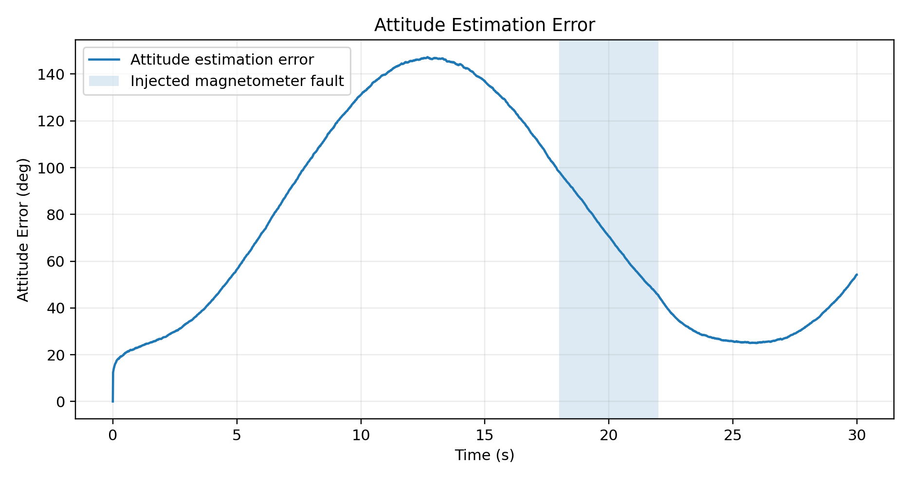
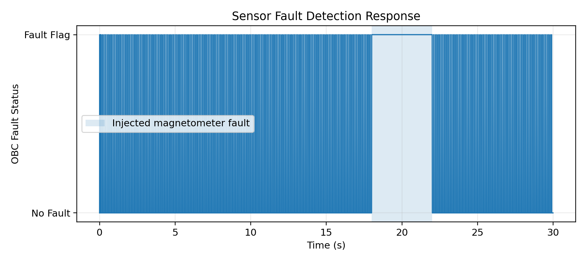

# Satellite Sensor Integration & Attitude Determination

Python simulation developed for the Apex OrbitalX technical assessment.

## Objective

This project demonstrates a satellite sensor-fusion architecture for real-time attitude determination using multi-rate sensor measurements.

## Sensors and Update Rates

| Sensor | Update Rate |
|---|---:|
| Star Tracker | 10 Hz |
| Sun Sensor | 20 Hz |
| Magnetometer | 50 Hz |
| Accelerometer | 100 Hz |
| GPS Receiver | 10 Hz |

The OBC uses a common 100 Hz processing cycle to handle asynchronous sensor measurements.

## Simulation Features

- Multi-rate sensor data generation
- Common 100 Hz OBC cycle
- Timestamp-based asynchronous data handling
- Quaternion-based attitude estimation
- Measurement validation
- Residual-based fault detection
- Magnetometer fault injection
- Attitude estimation error analysis

## Fault Injection

A magnetometer fault is intentionally injected between:

**18 s – 22 s**

The fault is detected using measurement consistency/residual checks and the invalid measurement is rejected and flagged.

## Processing Flow

Sensor Data  
→ Time Synchronization  
→ Measurement Validation  
→ Sensor Fusion  
→ Attitude Estimation  
→ Fault Detection

## Simulation Results

### Attitude Estimation Error

### Sensor Fault Detection

## Software

- Python 3.x
- NumPy
- Matplotlib

## Files

| File | Description |
|---|---|
| `apex_orbitalx_sensor_fusion_simulation.py` | Main Python simulation |
| `attitude_estimation_error.png` | Attitude estimation error plot |
| `sensor_fault_detection.png` | Sensor fault detection plot |
| `README.md` | Project documentation |

## Engineering Note

The assessment does not specify a gyroscope. Therefore, the simulation does not assume an unavailable gyroscope and uses the listed sensors for measurement-based attitude estimation and validation.
